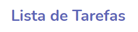
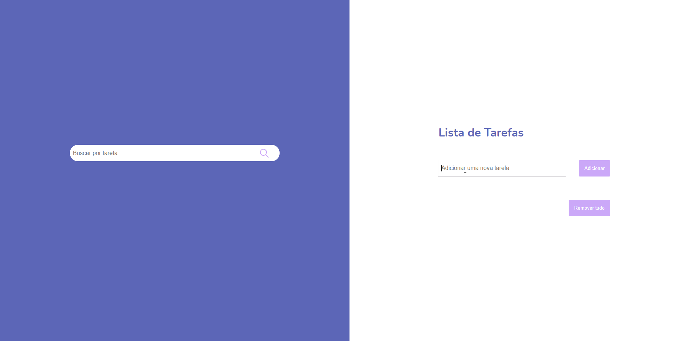
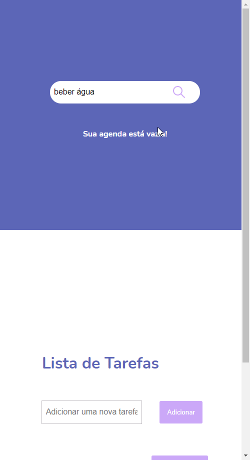

<h1 align="center">
      
    To-do-List 
</h1>

        

<h4 align="center">
    Lista de tarefas desenvolvida para consolidar conceitos de armazenamento, editar, excluir e inserir dados no LocalStorage.
</h4>
 

    
    

### 🚀 Tecnologias

 Projeto desenvolvido com as seguintes tecnologias: 

- HTML
- CSS
- JavaScript
- LocalStorage

 

### 📝 Licença
O projeto contém a licença MIT. Para mais informações acesse [LICENSE]().

 

Feito com 💖 por TamirysNogueira. [Get in Touch!](https://www.linkedin.com/in/tamirys-nogueira-346958205/)